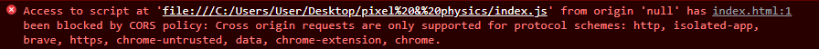

# Pixelzz & Physics

[Essayez moi ici !](https://aeilxs.github.io/pixels_and_physics/)

Analyse d'image en Javascript vanilla et animation de pixels. Le code est facilement réutilisable sur d'autres projets en remplaçant les valeurs des propriétés friction (entre 0 et 1), mouse (au choix !) et ease (entre 0 et 1) et supprimer les listeners dans le constructors !

## class Particle

Représente une particule.

```js
class Particle {
  constructor(effect, x, y, color) {
    // référence à la classe effet, n'est pas une copie de classe effet
    this.effect = effect;
    /*
      x et y représentent les coordonnées x et y de la particule sur le canvas
      grâce à la référence à effect, on peut accéder à effect.width et effect.height
      pour randomiser la position de chaque particule
      à l'intérieur du canvas
    */
    this.x = Math.random() * this.effect.width;
    this.y = Math.random() * this.effect.height;
    // origin X et Y permettent à la particule de se "rappeler" sa position initiale
    this.originX = Math.floor(x);
    this.originY = Math.floor(y);
    this.color = color;
    this.size = this.effect.gap;
    // velocity X et Y
    this.vx = 0;
    this.vy = 0;
    this.ease = document.getElementById('ease').value;
    // distance x distance y
    this.dx = 0;
    this.dy = 0;
    // calculée dans update
    this.distance = 0;
    /*
     la force de répulsion, à noter que si dans update on change le signe -
     par le signe + cela devient la force d'attraction ! je vous laisse essayer :)
    */
    this.force = 0.7;
    // calculé dans update
    this.angle = 0;
    this.friction = document.getElementById('friction').value;
  }
}
```

## class Effect

Créer et gère les effets sur l'ensemble des particules.

```js
  constructor(width, height) {
    // width et height permettent à l'effet de connaître la taille du canvas
    this.width = width;
    this.height = height;
    // contiendra toutes les instances de Particle
    this.particlesArray = [];
    this.image = document.getElementById('image1');
    this.centerX = this.width * 0.5;
    this.centerY = this.height * 0.5;
    this.x = this.centerX - this.image.width * 0.5;
    this.y = this.centerY - this.image.height * 0.5;
    /*
      gap est "l'incrémenteur" de la boucle for imbriquée de la méthode init, pour des raisons de performance
      il permet de "sauter" des pixels, baisser sa valeur c'est s'assurer un effect très laggy ! l'augmenter,
      c'est avoir une image de moins bonne qualité (pixelisée) mais de meilleures performances
     */
    this.gap = 3;

    this.mouse = {
      // x et y seront actualisé à chaque event mousemove avec les propriétés de l'event
      radius: document.getElementById('mouseRadius').value,
      x: undefined,
      y: undefined,
    };
    //  ...
  }
```

## Découpage de l'image en pixel

```js
// Effect.js
  init(context) {
    context.drawImage(this.image, this.x, this.y);
    const pixels = context.getImageData(0, 0, this.width, this.height).data;
    for (let y = 0; y < this.height; y += this.gap) {
      for (let x = 0; x < this.width; x += this.gap) {
        /*
          getImageData retourne un objet imageData avec une propriété data qui contient
          un tableau d'entier, c'est pour ça qu'on multiplie index par 4 pour accéder à l'index du premier
          pixel (rouge en l'occurence) à chaque fois
        */
        const index = (y * this.width + x) * 4;
        const red = pixels[index];
        const green = pixels[index + 1];
        const blue = pixels[index + 2];
        const alpha = pixels[index + 3];
        const color = `rgb(${red}, ${green}, ${blue})`;
        /*
          si le pixel n'est pas totalement transparent, on créer une nouvelle instance de Particle avec
          la référence à Effect, ses coordonnées x et y ainsi que la couleur
        */
        if (alpha > 0) {
          this.particlesArray.push(new Particle(this, x, y, color));
        }
      }
    }
  }
```

Concrètement, cette méthode vérifie chaque "pixel" du canvas (presque, suivant this.gap pour des raisons de performance), ligne par ligne et éventuellement, ajoute le "pixel" à particlesArray.

## update()

```js
// Particle.js
update() {
    this.dx = this.effect.mouse.x - this.x;
    this.dy = this.effect.mouse.y - this.y;

    /*
     théorème de pythagore, on pourrait utiliser Math.sqrt mais pour des raisons
     de performance il vaut mieux comparer la distance à la valeur radius sans avoir
     connaître la distance exacte entre les points
     => plus rapide que Math.sqrt(dx * dx + dy * dy)
    */

    this.distance = this.dx * this.dx + this.dy * this.dy;
    this.force = +this.effect.mouse.radius / this.distance;

    /*
      si distance entre particule et souris est inférieur à la taille du rayon de la souris
      (définit dans Effect), repousse les particules
    */

    if (this.distance < this.effect.mouse.radius) {
      this.angle = Math.atan2(this.dy, this.dx);
      this.vx -= this.force * Math.cos(this.angle);
      this.vy -= this.force * Math.sin(this.angle);
    }

    // cette partie attire les particules vers leur position d'origine
    this.x += (this.vx *= this.friction) + (this.originX - this.x) * this.ease;
    this.y += (this.vy *= this.friction) + (this.originY - this.y) * this.ease;
  }
```

### Eviter les erreurs CORS en local avec les images et les canvas ?

```html

```



On peut l'éviter avec une [base64 string](https://www.base64-image.de/). Néanmoins avec un serveur il ne devrait pas y avoir de problème ! :tada: :tada:
